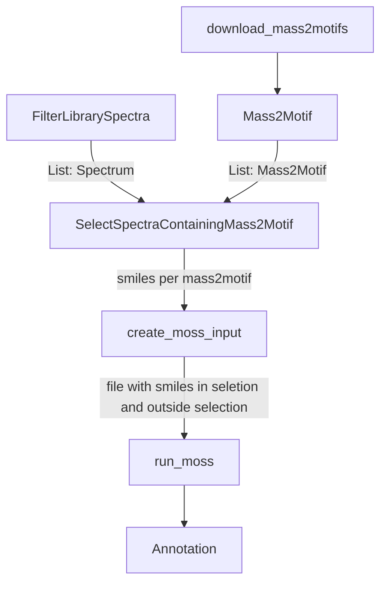

Workflow for automatically annotating mass2motifs

```mermaid
flowchart TD
    FilterLibrarySpectra --> |List: Spectrum| SelectSpectraContainingMass2Motif
    download_mass2motifs --> Mass2Motif
    Mass2Motif --> |List: Mass2Motif| SelectSpectraContainingMass2Motif
    SelectSpectraContainingMass2Motif --> |smiles per mass2motif| create_moss_input
    create_moss_input --> |file with smiles in seletion and outside selection| run_moss
    run_moss --> Annotation
```